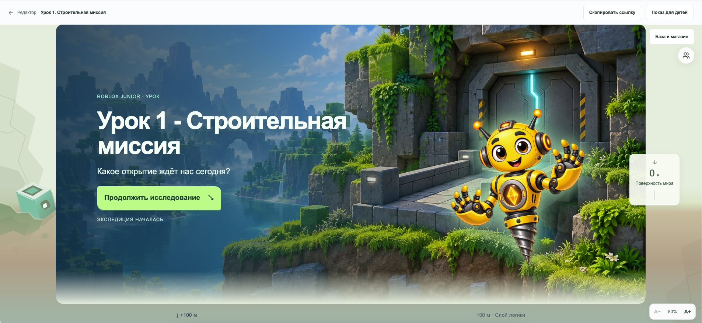
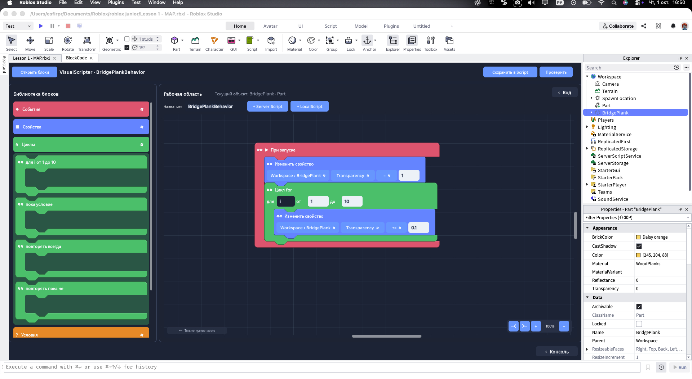
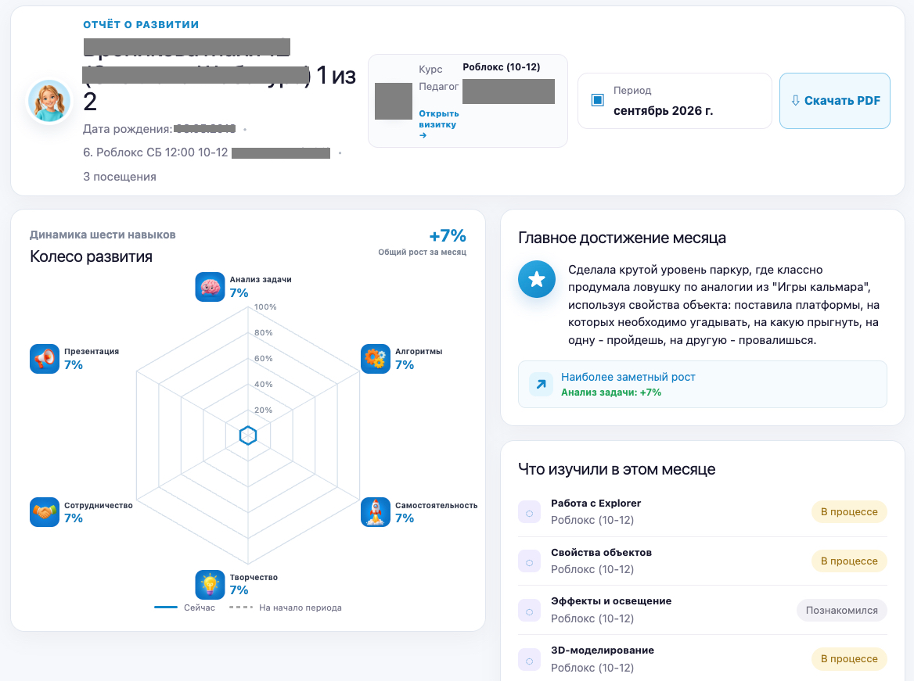

# Esfir Product Portfolio

Portfolio of an AI Product / Full-stack Developer. Four detailed case studies with original screenshots, video demos, product decisions and architecture flows. Built with Next.js App Router, TypeScript, React and Tailwind CSS 4.

## Local development

Requires Node.js 20.9+ and npm.

```sh
npm ci
npm run dev
```

Open http://127.0.0.1:3000.

```sh
npm run typecheck
npm run build
npm start
```

## Deploy to GitHub Pages

```sh
npm ci
npm run build:pages
```

Publish the contents of `out/` to the `gh-pages` branch and add an empty `.nojekyll` file at its root. In repository Settings → Pages, choose Deploy from a branch → `gh-pages` → `/ (root)`. The export uses `/esfir-product-portfolio` as its base path, including media, favicon and case-study links.

The default build stays compatible with Vercel.

## Deploy to Vercel

Push the project to a GitHub repository named `esfir-product-portfolio` or `ai-product-developer-portfolio`, import it in Vercel and select the Next.js preset. Keep the default build command (`npm run build`) and output directory. No database, environment variables or third-party keys are needed. Set your domain in Vercel after deploying.

Suggested repository description: “AI Product / Full-stack Developer portfolio — product case studies, architecture, educational applications and AI-assisted engineering.”

## Structure

- `app/page.tsx` — portfolio homepage
- `app/projects/[slug]/page.tsx` — statically generated case studies
- `app/layout.tsx` — SEO and Open Graph metadata
- `app/globals.css` — design tokens and responsive layouts
- `components/site.tsx` — shared navigation, cards, diagrams and app gallery
- `data/projects.ts` — typed project content, game links and database overview
- `public/projects/` — original project screenshots and video demos
- `public/favicon.svg` — portfolio favicon

## Content and media

Project content follows the supplied brief. The Vector of Growth role explicitly describes participation in product design and selected functionality, without claiming sole authorship. Product metrics are limited to the supplied 120+ users.

Screenshots use Next.js image optimization. Video files load only on demand (`preload="none"`). Architecture flows are semantic HTML; the complete supplied ER diagram is available in a disclosure panel. No stock imagery or invented product screenshots are used. The learning-app illustrations represent topics, not actual application interfaces.

The licensing dashboard screenshot is included with its secret access URL and account email hidden. Only the redacted copy is included in public assets. Email (esfirpr@gmail.com), Telegram (@EsfirPr) and GitHub link to the supplied contacts. HH is omitted until a verified profile URL is supplied. Live application links preserve the exact `esfirpr` and `esfir` accounts from the brief; all seven demo URLs returned HTTP 200 during local verification on 2026-10-01.

No analytics, cookies, tracking scripts, API keys or forms are included. The site supports keyboard navigation, reduced motion, responsive layouts and descriptive image alternatives.

## Screenshots





## Publication checklist

- Add a verified HH profile URL if desired.
- Confirm permission to publish project materials and visible names in the supplied screenshots.
- Check the seven external demo URLs and repository visibility.
- Run a production build; measure Lighthouse against the deployed URL.

No Lighthouse scores are claimed without measurement. Open Graph includes text metadata; no generated social image is included.
